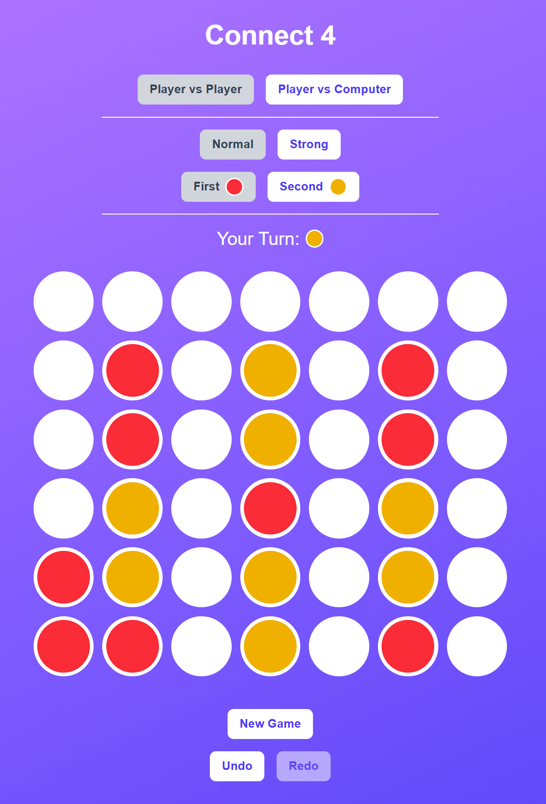

# Connect 4

This is a web-based implementation of the classic "Connect 4" game, built with Next.js and React. It offers various features and a responsive design for an engaging user experience.

## Features & Technical Insights

### Game Modes

*   **Player vs Player:** Enjoy a local two-player experience on the same device.
*   **Player vs Computer:** Challenge yourself against an AI opponent.

### Difficulty Levels (for Player vs Computer)

*   **Normal:** A basic AI that prioritizes winning moves, blocks immediate threats, and otherwise makes random valid moves.
*   **Strong:** This difficulty utilizes a simplified minimax algorithm with a limited search depth (currently 3 moves ahead). The AI evaluates potential moves by assigning scores based on immediate wins, blocking opportunities, and strategic board positions. While not a perfect, unbeatable AI (as Connect 4 is a solved game that can lead to a draw with perfect play), it provides a significantly more challenging opponent.

### Undo/Redo Functionality

*   Players can undo their last move and redo a previously undone move. When playing against the computer, a single undo/redo action will revert/reapply both the player's move and the computer's subsequent move, effectively undoing/redoing a full round of play. This is implemented by maintaining a `history` array of board states within the `useGame` React hook. Each valid move adds a new board state to the history, allowing for seamless navigation through past turns.

### Responsive Design

*   The game board, pieces, and control elements are designed to adapt gracefully to various screen sizes, from mobile devices to large desktop displays. This is achieved using responsive CSS units (like `vw` for viewport width) and Tailwind CSS utility classes, ensuring a consistent and enjoyable experience across different devices.

### Dynamic Player Colors

*   When playing against the computer, players can choose to go "First" (Red pieces) or "Second" (Yellow pieces). The game dynamically assigns colors to the human player and the computer opponent based on this choice. This is managed by a `playerColors` state in the `useGame` hook, which maps player IDs ('1' and '2') to their respective CSS color classes.

### Visual Feedback & User Experience

*   **Current Turn Indicator:** Clear visual cues (text and colored circles) indicate whose turn it is.
*   **Winning Line Highlight:** When a player wins, the four connected pieces forming the winning line are highlighted with a distinct animation.
*   **Hover Effect:** When hovering over a column, a semi-transparent preview of the piece is shown, indicating where the piece will drop.
*   **Clickable Cursors:** The mouse cursor changes to a pointer over clickable game cells and buttons, providing intuitive feedback.
*   **Disabled Buttons:** Undo/Redo buttons are disabled when no actions are available, and game board interaction is disabled when the game has ended or when a player choice is pending.

## Getting Started

To run this project locally:

1.  Clone the repository.
2.  Install dependencies: `npm install`
3.  Start the development server: `npm run dev`
4.  Open your browser to `http://localhost:3000`